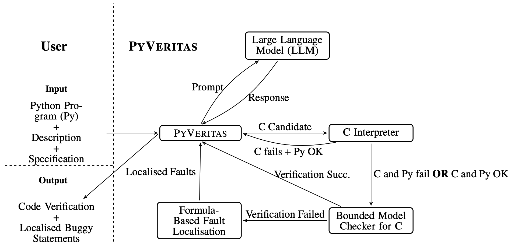

Understanding the **reasoning** and **robustness** of AI systems, such as **Large Language Models (LLMs)**, is critical for ensuring their reliable use in programming tasks.  

While recent studies have assessed LLMs’ ability to predict program outputs, most focus solely on **accuracy**, without evaluating the **reasoning** behind those predictions. Moreover, research on the reasoning of these models has shown that LLMs can often arrive at *correct answers through flawed logic*, raising concerns about similar issues in **code understanding**.

Developing **Artificial Intelligence for Reliable Code** requires bridging the gap between *statistical learning* and *formal reasoning*. This research explores how **Large Language Models (LLMs)** can be guided and evaluated to ensure their decisions in programming contexts are **logical, interpretable, and verifiable**. Our work spans three complementary directions:  
1. analysing the **reasoning capabilities** of LLMs in understanding code,  
2. developing **formal verification frameworks** for Python using LLMs, and  
3. integrating **fault localisation and program synthesis** to enable LLM-assisted **automated program repair**.  

Together, these efforts aim to build the foundations of **trustworthy AI for software engineering**, models that not only generate correct code but can also **explain, verify, and repair** it with formal rigour.

---

## 🔍 Evaluating LLM Reasoning in Code Understanding  

In this project, we first conducted a [study](https://arxiv.org/abs/2505.10443) to evaluate whether state-of-the-art LLMs (up to 8B parameters) can *reason* about Python programs or are merely *guessing*.  

We applied **five semantics-preserving code mutations**:
- variable renaming,  
- mirroring comparison expressions,  
- swapping if–else branches,  
- converting `for` loops to `while`, and  
- loop unrolling.  

These transformations preserve program semantics while altering syntax.  

We evaluated **six LLMs** and performed a **human expert analysis** using *LiveCodeBench* to determine whether correct predictions stemmed from sound reasoning. Additionally, we assessed prediction **stability** under code mutations using both *LiveCodeBench* and *CruxEval*.  

[Our findings]() show that LLMs trained for code often produce *correct predictions through flawed reasoning* in **10–50% of cases**. Furthermore, many models changed their predictions across equivalent code versions, indicating a lack of **semantically grounded reasoning**.  

Based on these insights, we argue that current evaluation paradigms for LLMs in code understanding, focused primarily on accuracy, are **not fit for purpose**. Progress in this field requires shifting toward **neuro-symbolic frameworks** that prioritise **transparent reasoning** and **formal semantic guarantees**.  

---

## 🧩 PyVeritas 🐍: Formal Verification for Python via LLMs  

Python has become the dominant language for general-purpose programming, yet it still lacks robust tools for **formal verification**. In contrast, languages such as **C** benefit from mature model checkers, like **[CBMC](https://github.com/diffblue/cbmc)**, that enable **exhaustive symbolic reasoning** and **fault localisation**.  

However, the **semantic complexity of Python** and the **verbosity of existing transpilers** (e.g., **[Cython](https://cython.org)**) have historically limited the applicability of such verification techniques to Python programs.  

To address this gap, we developed **[PyVeritas](/publications/p-ai-fm-2026)**, which is a novel framework that leverages **Large Language Models (LLMs)** for **high-level transpilation** from Python to C, followed by **bounded model checking**, using CBMC, and **MaxSAT-based fault localisation**, using **[CFaults](/projects/cfaults)**, on the generated C code.  

The following figure illustrates the PyVeritas verification pipeline:  

The goal of PyVeritas is to **bridge the gap in formal verification for Python**, providing an effective verification pipeline **while a robust native model checker for the language is still lacking**.  

PyVeritas operates by translating Python programs into C code using LLM-based transpilation, then leveraging mature C verification infrastructure to perform **symbolic analysis** and **fault localisation**.

Given a Python program and its specification, PyVeritas returns either a **formal correctness or failure verdict**, or a **set of localised buggy statements** mapped back to the original Python source.  

In this way, PyVeritas enables **formal verification** and **bug localisation** for Python code using existing model-checking tools for C.  

Our empirical evaluation on two Python benchmarks shows that LLM-based transpilation can achieve **80–90% accuracy** for some models, enabling an effective environment that supports **assertion-based verification** and **interpretable fault diagnosis** for small yet non-trivial Python programs.  

---

## 🔧 Guiding LLMs for Automated Program Repair  

To further advance the reliability of AI-assisted programming, we have also explored **hybrid approaches** that combine **formal reasoning** with **LLM-based synthesis** for automated program repair.

In this direction, we integrated **[CFaults](/projects/cfaults)**, a **MaxSAT-based fault localisation tool**, with *Large Language Models (LLMs)* using a **zero-shot learning** setup to enhance automated program repair for **C programming assignments**.  

CFaults precisely pinpoints buggy statements in a C program using information from failing test cases. In our framework, the faulty statements identified by CFaults are removed, creating a **program sketch** that is then passed to the LLM.  

The LLM is asked to **synthesise replacements** for the missing code, which are validated against a test suite. If the synthesis fails, a **counterexample** from the test suite is fed back to the LLM, guiding the next iteration, following a **Counterexample-Guided Inductive Synthesis (CEGIS)** loop.  

[This hybrid approach](/publications/aaai2025) enables LLMs to repair more programs and generate smaller, more precise fixes, **outperforming both purely neural and purely symbolic program repair methods**.  

By integrating formal fault localisation with adaptive synthesis, this work has demonstrated how **formal verification** and **machine learning** can complement each other to achieve **more reliable and interpretable software repair**.

---

Together, these efforts aim to **bridge the gap between AI-driven code generation and formal verification**, paving the way for **more transparent, reliable, and trustworthy programming AI systems**.

---

##  References

- **Pedro Orvalho**, and Marta Kwiatkowska (2025). [Are Large Language Models Robust in Understanding Code Against Semantics-Preserving Mutations?](https://arxiv.org/abs/2505.10443). In *arXiv* 2025. 

- 

- 

- 

<!--more-->

I am always excited to explore new ideas together! **Feel free to reach out** 📧 if you are interested in collaborating on this research topic!
