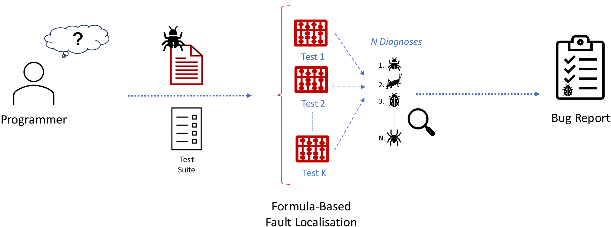
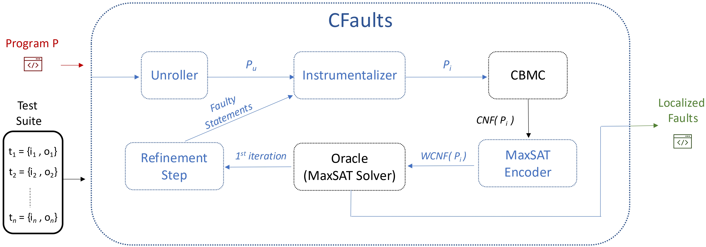

Localising system faults has long been recognised as one of the most **time-consuming and costly** tasks in software engineering.  

Given a buggy system, **fault localisation (FL)** refers to the process of identifying program locations that may cause faulty behaviour (*bugs*).  

More specifically, given a faulty system and a set of observations (e.g., failing test cases), **formula-based fault localisation (FBFL)** methods encode the localisation problem as a series of **constraint optimisation problems**, identifying a minimal set of faulty statements (diagnoses) within the system, as illustrated below:

FBFL approaches are typically grounded in the theory of [*Model-Based Diagnosis (MBD)*](https://www.sciencedirect.com/science/article/abs/pii/0004370287900622), which has been successfully applied to restore consistency across various domains, including Boolean circuits, C software, knowledge bases, and spreadsheets.  
Traditionally, these methods compute a minimal diagnosis by considering each failing test case **individually**, rather than simultaneously across all failures.

---

## ⚙️ The CFaults Project  

**CFaults** introduces a novel approach to fault localisation that leverages **Maximum Satisfiability (MaxSAT)**, the optimisation variant of SAT, together with **Model-Based Diagnosis (MBD)** to perform **multi-test-case FBFL for C programs**.  

Our approach is implemented in a publicly available tool, **_CFaults_**, designed to **see faults in C**.  

Unlike existing methods, CFaults consolidates **all failing test cases into a unified MaxSAT formula**, ensuring consistency and precision across the fault localisation process.  
In our [paper](/publications/fm2024), we demonstrate that CFaults produces **only minimal diagnoses** of faulty statements, while other FBFL methods for C software (e.g., *BugAssist* and *SNIPER*) tend to output redundant diagnoses.

---

### 🔍 System Overview  

CFaults comprises **six main steps**:  
1. **Program unrolling**  
2. **Program instrumentalisation**  
3. **Bounded model checking (via [CBMC](https://github.com/diffblue/cbmc))**  
4. **Encoding to MaxSAT**  
5. **Oracle resolution (MaxSAT solver)**  
6. **Diagnosis refinement**

The process begins by unrolling and instrumentalising C programs at the code level, ensuring independence from the model checker. CFaults then employs CBMC to generate a **trace formula** of the program, which is subsequently encoded into MaxSAT to identify the **minimal set of faulty statements**.  

---

Explore CFaults!

---

## 🚀 Recent Use Cases of CFaults  

CFaults has been successfully applied in multiple research directions, demonstrating its flexibility across educational and AI-driven settings:

---

### 🎓 Providing Feedback in Programming Education  

In *Spring 2024*, CFaults was integrated with [**GitSEED**](/projects/gitseed), a *GitLab*-backed automated assessment tool for software engineering and programming education, to provide automated feedback in a first-year undergraduate C programming course.  

Among the findings, **69% of surveyed students** reported that the *hints* generated by CFaults were **helpful** in identifying and correcting their code errors. These localised hints encouraged **self-directed debugging** and a deeper understanding of programming concepts.  

Overall, [this study](/publications/sigcse-virtual-2024) demonstrated CFaults’ value as a **pedagogical tool**, reinforcing its potential as a bridge between **formal reasoning** and **effective programming education**.  

---

### 🤖 Guiding LLMs for Automated Program Repair  

CFaults has also been integrated with **Large Language Models (LLMs)** via **zero-shot learning** to enhance automated program repair for C assignments.  

In this hybrid framework, CFaults first identifies faulty statements and produces a **program sketch** with those statements removed.  
[**This approach**](/publications/aaai2025) follows a **Counterexample-Guided Inductive Synthesis (CEGIS)** loop:  

1. The LLM synthesises code to fill in the missing parts.  
2. The result is validated against a test suite.  
3. If incorrect, a counterexample is provided to guide refinement.  

This iterative process enables LLMs to repair **more programs** and produce **smaller, higher-quality fixes**, outperforming both purely neural methods and state-of-the-art symbolic repair tools.  

---

### 🐍 Formula-Based Fault Localisation for Python  

CFaults’ underlying principles have also been extended beyond C.  

[**PyVeritas**](https://arxiv.org/pdf/2508.08171) is a framework that uses **LLMs for high-level transpilation** from Python to C, followed by **bounded model checking** and **MaxSAT-based fault localisation** via CFaults.  

This approach enables verification and bug localisation for Python code using existing C verification tools.  
Empirical evaluations on Python benchmarks demonstrate that LLM-based transpilation achieves **80–90% accuracy** for some models, opening a new pathway for combining **language models** with **formal verification**.  

---

CFaults exemplifies how **symbolic reasoning and constraint optimisation** can serve as the foundation for **trustworthy AI-assisted software development**, spanning applications from **education** to **automated repair** and **cross-language verification**.

## References

- 

- 

- 

- 

- **Pedro Orvalho**, and Marta Kwiatkowska (2025). [PyVeritas: On Verifying Python via LLM-Based Transpilation and Bounded Model Checking for C](https://arxiv.org/abs/2508.08171) In *arXiv* 2025. 

<!--more-->

I am always excited to explore new ideas together! **Feel free to reach out** 📧 if you are interested in collaborating on this research topic!
