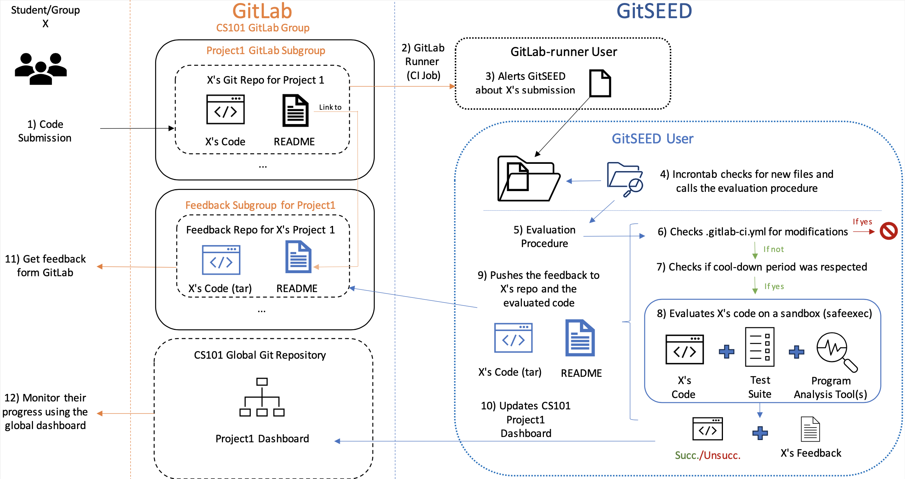

Delivering **personalised, scalable feedback** to students in large programming courses remains one of the most persistent challenges in Computer Science and Software Engineering education.  
Traditional **Automated Assessment Tools (AATs)** often struggle with **integration flexibility**, **language dependence**, and **limited feedback modalities**, typically supporting only one language and relying solely on test-suite-based evaluation through dedicated web interfaces.  

---

## 🌱 Introducing GitSEED  

**GitSEED** is a **Git-backed, language-agnostic automated assessment platform** designed for **Programming Education** and **Software Engineering (SE) Education**.  

Students interact with GitSEED entirely through **GitLab**, enabling a natural workflow that mirrors professional software development practices. Using GitSEED, Computer Science and SE students **master essential version control concepts** while receiving **automated, personalised feedback** on their programming assignments and projects.  

Meanwhile, **faculty members can easily customise GitSEED’s evaluation pipeline** by integrating a variety of program analysis and verification tools, such as [**Valgrind**](https://valgrind.org) for memory leak detection; [**CFaults**](/projects/cfaults) for MaxSAT-based fault localisation; and [**MENTOR**](/projects/mentor) for semantic program repair.  

This modularity allows educators to provide feedback that is **aligned with course goals** and **adaptable across programming paradigms and languages**.

---

## ⚙️ Workflow  

The figure above illustrates the **GitSEED workflow**.  

1. **Student submission:** Students interact with GitSEED via GitLab by committing their code to a project repository.  
2. **Automated trigger:** GitLab’s runners automatically notify GitSEED upon each new submission.  
3. **Evaluation:** GitSEED evaluates the submission against predefined test suites and the configured analysis tools.  
4. **Feedback delivery:** A detailed feedback report is automatically pushed back to the student’s Git repository, providing **immediate and actionable insights**.  

In addition, GitSEED maintains **dashboards and leaderboards** for each evaluation element, which are posted in the central course repository.  
These dashboards allow students to **track their progress**, monitor test success rates, compare performance with peers, and visualise their improvement over time.  

Thanks to the integration with modern development environments (e.g., **VS Code**, which natively supports git), students can **submit assignments and receive feedback directly within their workspace**, minimising context switching. For those preferring web-based workflows, GitLab’s interface remains fully supported.

---

## 🧪 Deployment and Impact  

Since 2023, **GitSEED has been deployed in three courses (across seven course executions)** at *Instituto Superior Técnico (IST)*.  
Experimental evaluations examined GitSEED’s impact on student engagement and learning outcomes, revealing **positive correlations between GitSEED usage and improved performance** in diverse Computer Science courses.  

GitSEED’s flexibility makes it suitable for a wide range of educational settings, from introductory programming to advanced logic-based problem solving.

---

## 🚀 Recent Use Cases of GitSEED  

- **C Programming Courses:**  
  GitSEED detected **memory leaks and logic bugs**, helping students identify low-level errors and strengthen debugging skills.  

- **Logic Programming (Prolog):**  
  GitSEED was configured to provide **automated bug localisation** and **style suggestions**, supporting good programming practices and enhancing students’ understanding of declarative problem solving.  

- **Master’s Course in Computational Logic:**  
  GitSEED supported the assessment of projects focused on **NP-hard optimisation problems**, where students implemented solutions using SAT/SMT solvers in Python.  
  The pipeline was extended with **custom analysis tools** to evaluate **satisfiability and optimality**, offering richer feedback beyond correctness.

A distinctive pedagogical feature of GitSEED is its **feedback philosophy**: rather than offering direct fixes, GitSEED highlights **problematic regions in the student’s code**, encouraging reflection, exploration, and **independent problem-solving**.  

---

Explore GitSEED!

---

GitSEED represents a step towards **scalable, transparent, and customisable AI-driven assessment systems**, empowering educators to blend **formal analysis tools** with **human-centred teaching**, and students to learn through feedback that is **immediate, interpretable, and authentic to real-world software engineering practice**.

---

## Reference

- 

- 

- Ricardo Brancas, Vasco Manquinho and Ruben Martins (2025). [Combining Logic and Large Language Models for Assisted Debugging and Repair of ASP Programs](https://www.ricardobrancas.com/files/formhe25.pdf) In **ICST 2025**. 

- Ricardo Brancas, **Pedro Orvalho**, Carolina Carreira, Vasco Manquinho, Ruben Martins (2025). [Can Automated Feedback Turn Students into Happy Prologians?](https://arxiv.org/pdf/2504.16742). *In arXiv 2025*.

I am always excited to explore new ideas together! **Feel free to reach out** 📧 if you are interested in collaborating on this research topic!

<!--more-->
