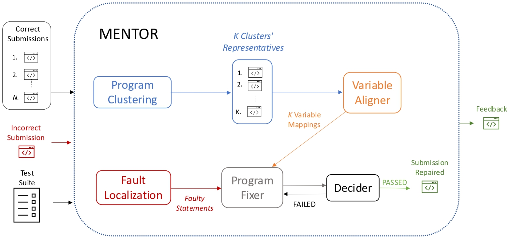
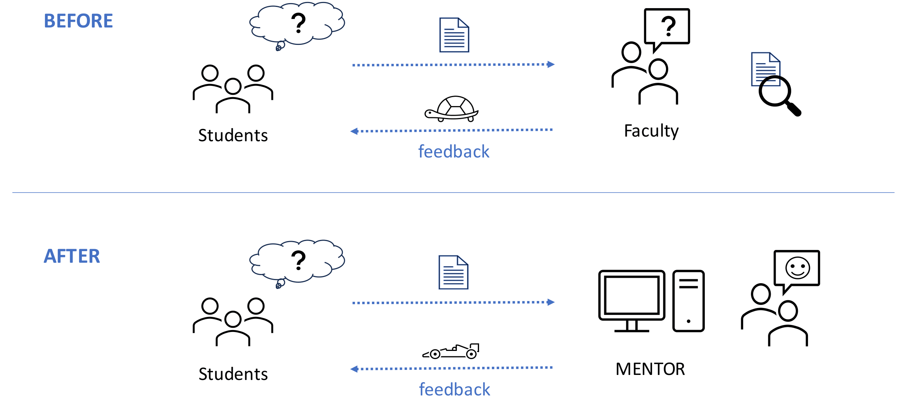

Delivering **valuable and personalised feedback** to students remains one of the greatest challenges in programming education, particularly in courses with large enrollments.  
Providing individualised guidance for every student submission is often infeasible, motivating the development of **automated, intelligent tutoring systems** capable of analysing and repairing student code.  

---

## 🧩 The MENTOR Framework  

In this project, we have been developing **MENTOR**, a **semantic Automated Program Repair (APR)** framework designed to provide auto**m**ated f**e**edback for i**n**troduc**t**ory pr**o**gramming exe**r**cises.

MENTOR validates repairs through execution on a test suite and returns either a **repaired program** or a **highlighted version** of the student’s code pinpointing the faulty statements.  

As shown in the figure above, MENTOR receives as input an incorrect student submission, a test suite, and a set of *N* correct submissions for the same IPA.  
The framework is composed of **five main modules**:  
1. **Program Clustering**  
2. **Variable Aligner**  
3. **Fault Localisation**  
4. **Program Fixer**  
5. **Decider**

---

### 🧠 How It Works  

1. **Program Clustering:**  
   MENTOR begins by clustering correct submissions using [**InvAASTCluster**](/publications/jss2025), which leverages both **invariants** and **Abstract Syntax Trees (ASTs)** to identify structural and semantic similarities across programs.  

2. **Variable Alignment:**  
   Using **Graph Neural Networks (GNNs)**, MENTOR performs [variable mapping](/publications/ecai2023) between each cluster’s representative program and the incorrect submission.  
   Accurate variable mapping is a crucial step for tasks such as **program equivalence**, **code analysis**, and **automated repair**.  

3. **Fault Localisation:**  
   For localising faulty statements, MENTOR employs [**CFaults**](/projects/cfaults), a **MaxSAT-based formula-driven fault localisation tool** capable of handling multiple faults simultaneously.  
   CFaults applies *Model-Based Diagnosis (MBD)* principles to consolidate all failing test cases into a unified **MaxSAT** formulation, ensuring consistent and minimal diagnoses.  

4. **Program Fixing:**  
   The [program fixer module](/publications/aaai2025) integrates the information gathered so far — cluster representatives, variable mappings, and localised faults — into structured prompts for **Large Language Models (LLMs)**.  
   Guided by **Counterexample-Guided Inductive Synthesis (CEGIS)**, MENTOR iteratively refines candidate repairs by evaluating each synthesis result against the test suite.  

5. **Decision and Feedback:**  
   The **Decider Module** verifies whether the candidate repair passes all test cases.  
   - If successful, MENTOR returns the repaired program or highlights the corrected statements.  
   - If unsuccessful, a counterexample is provided to guide the next synthesis iteration.  

---

## 📊 Experimental Results  

Experimental results on [**C-Pack-IPAs**](/publications/apr2024), a benchmark of introductory programming assignments, demonstrate that MENTOR’s **hybrid repair approach**, integrating **formal methods** with **LLM-based synthesis**, significantly enhances repair success rates while producing smaller and more precise fixes.  

MENTOR outperforms several state-of-the-art tools:  
- **Verifix:** 6.3% repair rate  
- **Clara:** 34.6% repair rate  
- **MENTOR:** *37.3%–64.4%*, depending on the LLM configuration and prompt strategy  

Moreover, unlike purely symbolic tools requiring identical control-flow graphs (CFGs), MENTOR’s LLM-driven synthesis **enables flexible repairs** even when structural alignment is not preserved.

---

## 🎯 Educational Impact  

As illustrated above, MENTOR aims to **support both students and lecturers** by providing **automated, personalised feedback** in introductory programming assignments.  

- **For lecturers:**  
  MENTOR simplifies evaluation and allows courses to scale to larger cohorts without sacrificing feedback quality.  

- **For students:**  
  MENTOR enhances self-learning by providing targeted feedback on **syntactic and semantic errors**, enabling faster comprehension and correction.  

Through the integration of **formal reasoning** and **neural synthesis**, MENTOR bridges the gap between **AI-driven feedback** and **pedagogical effectiveness**, paving the way for **next-generation intelligent tutoring systems** in computer science education.  

---

Read More About MENTOR

---

## References

- 

- 

- 

- 

- 

- 

- 

- 

- 

<!--more-->

I am always excited to explore new ideas together!
Feel free to reach out 📧 if you are interested in collaborating on these research topics.
