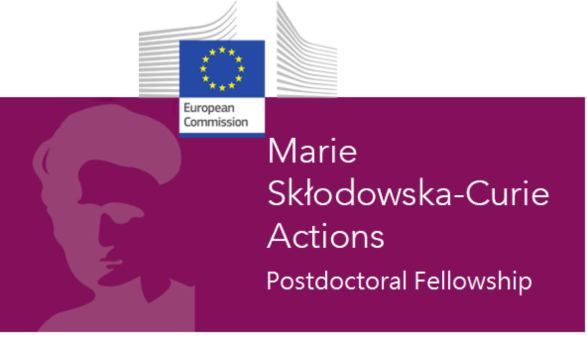
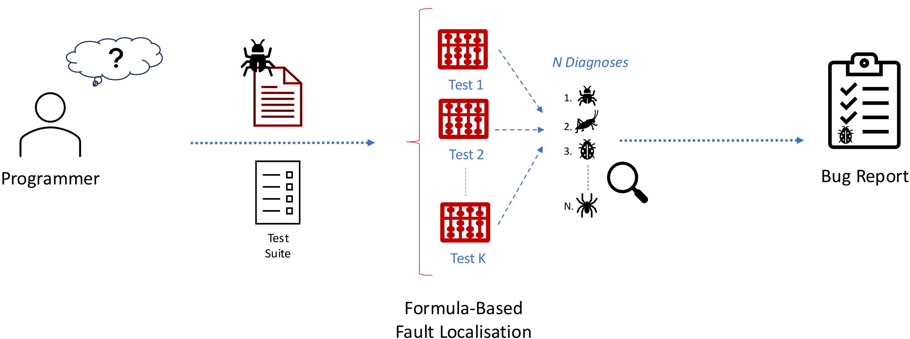

# 🔎🐛 Sherlock4Py 🐍

## MaxSAT-Based Misbehaviour Verification and Localisation Framework for Python

**Sherlock4Py** is a research project investigating how **formal reasoning**
and **Large Language Models (LLMs)** can work together to find, explain, and
repair bugs in Python programs.

The project brings together **Maximum Satisfiability (MaxSAT)**,
**formal verification**, **software engineering**, and **machine learning**
to make Python software and AI-assisted programming more reliable.

Sherlock4Py is funded by the **European Union** through the
**Marie Skłodowska-Curie Actions (MSCA) Postdoctoral Fellowships** under
Horizon Europe ([GA No. 101269051](https://cordis.europa.eu/project/id/101269051)).

  

---

## 🐛 Finding Bugs with Formal Reasoning

Given a buggy program and a set of failing test cases,
**Formula-Based Fault Localisation (FBFL)** uses logical reasoning to identify
the program statements that can explain the observed failures.

Program behaviour is encoded as logical constraints and techniques such as
**Maximum Satisfiability (MaxSAT)** and **Model-Based Diagnosis (MBD)** are
used to compute minimal sets of potentially faulty statements, known as
*diagnoses*.

While these techniques have been successfully applied to languages such as C,
Python remains comparatively underserved by exact fault-localisation methods.

At the same time, LLMs are increasingly used to generate and repair Python
code, despite providing no guarantee that the generated programs are correct.

**Sherlock4Py brings these two problems together.**

We are investigating **MaxSAT-based fault localisation for Python**, new
solver techniques that make this reasoning more scalable, and how precise
bug diagnoses can be used to **guide and verify LLM-generated program
repairs**.

> **Can exact symbolic reasoning and generative AI work together to make
> Python software more reliable?**

---

## 🧭 Where Sherlock4Py Comes From

Sherlock4Py builds on our previous research at the intersection of
**formal methods, fault localisation, program repair, and LLMs**.

Our work on **CFaults** introduced a MaxSAT-based approach for
formula-based fault localisation in C programs, using multiple failing test
cases simultaneously to compute precise diagnoses.

- 

We subsequently showed that these diagnoses can guide **Large Language Models
for automated program repair**: instead of asking an LLM to repair an entire
program, MaxSAT-based fault localisation first identifies where the problem
is likely to be.

- 

- 

With **PyVeritas**, we started extending these ideas towards Python by using
LLMs to transpile Python programs into C and then applying bounded model
checking and MaxSAT-based fault localisation.

- 

Sherlock4Py takes the next step: developing these formal reasoning techniques
**for Python itself**, while investigating how they can provide
correctness-aware guidance to AI models.

---

## 🔬 What We Have Been Working On

Since the beginning of Sherlock4Py, our work has explored several aspects of
the interaction between **LLMs and symbolic reasoning**.

### 🧠 Understanding the Limits of LLMs for Code

We investigated whether LLMs genuinely reason about Python program semantics
or rely partly on superficial syntactic patterns.

By applying **semantics-preserving transformations** to Python programs, we
found that model predictions can change even when program behaviour remains
identical.

- 

- **Pedro Orvalho**, and Marta Kwiatkowska (2025). [Are Large Language Models Robust in Understanding Code Against Semantics-Preserving Mutations?](https://arxiv.org/abs/2505.10443). In *arXiv* 2025.

These results reinforce one of the motivations behind Sherlock4Py:
**plausible LLM-generated code is not necessarily reliable code**.

---

### 🧩 Combining LLMs with MaxSAT

We have also been exploring how LLMs and exact solvers can complement each
other.

At **LLM-Solve @ FLoC 2026**, we investigated using LLMs to translate
natural-language optimisation problems into executable **PySAT** models,
while delegating the actual optimisation to an exact MaxSAT solver.

- 

The underlying philosophy is closely related to Sherlock4Py:

> **Use LLMs for their flexibility, and symbolic solvers for exact reasoning.**

---

### 🤖 MaxSAT-Based Feedback for AI

We have also investigated MaxSAT as a mechanism for providing
**correctness-aware feedback to AI models**.

Using Sudoku as a controlled reasoning problem, we combine
Vision-Language Models with a MaxSAT oracle that identifies inconsistent
predictions and provides feedback that the model can use to refine its
solution.

- 

This explores a broader idea central to Sherlock4Py:

> **Formal reasoning does not need to replace AI — it can guide it.**

For Python program repair, we aim to use the same principle:

**localise → generate → verify → provide feedback → repair**

---

### 🎓 Understanding Bugs and Useful Feedback

Another part of our research investigates what bugs programmers actually
write and what kinds of automated feedback are useful to them.

At **ICLP 2026**, we studied automated feedback for students learning Prolog
and developed a data-driven taxonomy of real student bugs.

- 

- 

Although these studies focus on Prolog, they provide useful insights for the
evaluation of Sherlock4Py: fault-localisation and repair systems should be
tested against **realistic programmer mistakes**, not only artificially
constructed bugs.

---

# 📢 Dissemination

Sherlock4Py results and closely related research are disseminated through
conference presentations, workshops, seminars, research visits, and
open-source research artefacts.

## 🎤 Talks & Events

---

### 📅 September 2026

**Large Language Models Are Not (Yet) Robust in Understanding Code Against
Semantics-Preserving Mutations**  
*25th EPIA Conference on Artificial Intelligence* — Funchal, Portugal,
4 September 2026.  
[Talk details →](/events/2026-09-04-epia/)

**MaxSAT-Based Feedback for Guiding Vision-Language Models in Sudoku**  
*25th EPIA Conference on Artificial Intelligence* — Funchal, Portugal,
2 September 2026.  
[Talk details →](/events/2026-09-02-epia/)

---

### 📅 July 2026

**Can Automated Feedback Turn Students into Happy Prologians?**  
*42nd International Conference on Logic Programming (ICLP), FLoC 2026* —
Lisbon, Portugal, 21 July 2026.  
[Talk details →](/events/2026-07-21-iclp/)

**Solving MaxSAT Problems from Natural Language Descriptions with LLMs
and PySAT**  
*LLM-Solve @ FLoC 2026* — Lisbon, Portugal, 19 July 2026.  
[Talk details →](/events/2026-07-19-llm-solve/)

---

### 📅 May 2026

**From Brittle LLM Code Reasoning to MaxSAT-Based Verified Repairs**  
*Software Systems Engineering Seminars, University College London* —
London, UK, 20 May 2026.  
[Talk details →](/events/2026-05-20-sse-seminars-ucl/)

**Towards Assessing and Repairing LLM-Generated Code via Model Checking
and MaxSAT-Based Fault Localisation**  
*Dagstuhl Seminar 26192 — Evaluation of AI Models in Software Engineering* —
Schloss Dagstuhl, Germany, 5 May 2026.  
[Talk details →](/events/2026-05-05-dagstuhl-26192/)


See all talks


---

## 📚 Publications

### Sherlock4Py & Related Research

- 

- 

- 

- 

- 

### Research Foundations

- 

- 

- 

- 

---

## 🔗 Project Information

**Sherlock4Py —  MaxSAT-Based Misbehaviour Verification and Localisation Framework for Python**

**Marie Skłodowska-Curie Postdoctoral Fellowship**  
Horizon Europe · Grant Agreement **101269051**

**Researcher:** [Pedro Orvalho](https://pmorvalho.github.io)  
**Host:** [Artificial Intelligence Research Institute (IIIA-CSIC)](https://www.iiia.csic.es/)  
**Supervisor:** Felip Manyà

[**Project DOI →**](https://doi.org/10.3030/101269051)

<strong>Funded by</strong>

<strong>Hosted by</strong>

---

Interested in **MaxSAT, fault localisation, Python verification,
program repair, or neuro-symbolic AI**?

**Feel free to reach out** 📧 if you are interested in discussing these
topics or exploring potential collaborations.