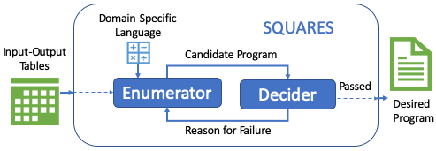

Many data analysts are **domain experts but lack programming expertise**. While they can describe *what* transformation they want to perform, they often struggle to express it in a query language such as SQL or R.  
This creates a growing demand for systems that can address the challenge of **Query Reverse Engineering (QRE)**, that is, *given a database and an output table, automatically derive the query that produces that output*.

---

## SQUARES

In this project, we developed [**SQUARES**](/publications/vldb2020), **A** **S**QL and R **S**ynthesiser **U**sing **Q**uery **R**everse **E**ngineering. SQUARES is a **program synthesiser** designed to help data analysts extract and transform data by **automatically synthesising SQL queries** and/or **table manipulation programs in R**.

SQUARES follows an **enumeration-based synthesis approach**, where, given a set of *input* and *output* tables, the system searches for the corresponding **query** that performs the desired transformation *(input → output)*.  
Importantly, SQUARES can output the discovered transformation both as **SQL code** and as **R code**, bridging the gap between database and data science workflows.

---

## ⚙️ Line-Based SMT Encoding

To efficiently explore the vast search space of possible programs, SQUARES employs a **compact line-based encoding** for *Satisfiability Modulo Theories (SMT)*, introduced in our earlier work on [line-based SMT encoding](/publications/cp2019).  
This encoding allows **faster enumeration of candidate programs** by representing the structure of SQL and R transformations as lines instead of representing each program as a single abstract syntax tree (AST).

Our experimental evaluations demonstrate that this encoding enables SQUARES to **synthesise more queries and handle larger benchmarks** than previous enumeration-based approaches, significantly improving both efficiency and scalability.

---

## 🌐 Try SQUARES

For more information about SQUARES, visit the project’s [website](https://squares-sql.github.io), or try it out directly in an interactive environment:

Try SQUARES on Google Colab!

---

SQUARES contributes toward **democratising data access and transformation**, allowing users without deep programming knowledge to **derive complex queries automatically**, and thus focus on their domain expertise rather than the intricacies of query syntax.

---

## References

- 

- 

- 

<!--more-->

I am always excited to explore new ideas together!
Feel free to reach out 📧 if you are interested in collaborating on these research topics.
