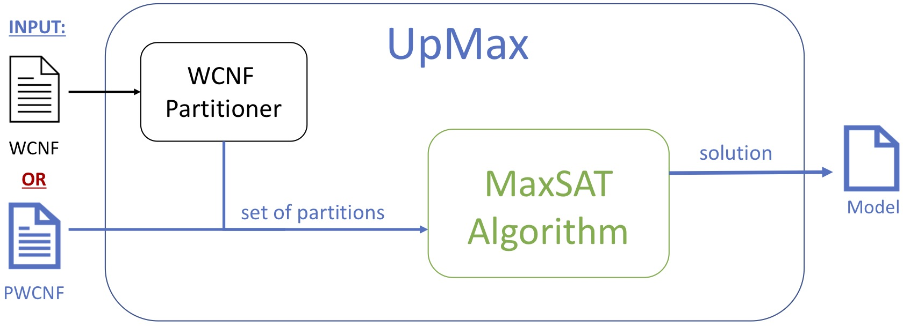

The **Maximum Satisfiability (MaxSAT)** problem is the optimisation variant of the **Satisfiability (SAT)** problem. Solving MaxSAT efficiently often involves **partitioning the set of soft clauses** into several disjoint subsets, which can be achieved through **clause-weight–based** methods (e.g., stratification) or **graph-based** representations of the formula. A subsequent **merge procedure** ensures that the overall optimal solution is obtained.

## ⚙️ UpMax

In this project, we developed [**UpMax**: *User Partitioning for MaxSAT*](/publications/sat2023), a **unified MaxSAT solver** that **decouples the partitioning procedure from the underlying MaxSAT solving algorithm**.  
This design enables new partitioning strategies to be defined **independently** of the specific MaxSAT solver, providing both **flexibility** and **modularity**.

UpMax empowers users constructing MaxSAT formulas to propose **domain-informed partitioning schemes**, leveraging their understanding of the problem structure.  
To support this, we introduced a new file format, **`pwcnf`**, which extends the standard **`wcnf`** format by allowing users to explicitly specify partition information derived from domain knowledge.

The figure above presents a schematic overview of **UpMax**, illustrating the **decoupling between the MaxSAT solving algorithm and the clause-partitioning process**.  
This separation allows UpMax to serve as a **versatile optimisation engine** adaptable to multiple domains where structured problem decomposition is beneficial.

---

Explore UpMax on GitHub

---

## 🧩 AlloyMax: An Application of UpMax  

[**Alloy**](https://en.wikipedia.org/wiki/Alloy_(specification_language)) is a **declarative modelling language** based on first-order relational logic, widely used to analyse software engineering models.  
Building on Alloy’s expressiveness, we developed [**AlloyMax**](/publications/fse2021), which **extends Alloy with optimisation capabilities** by integrating UpMax as its optimisation backend.

AlloyMax encodes high-level Alloy specifications into **MaxSAT formulas** and uses **UpMax** to efficiently compute optimal solutions.  
By exploiting domain knowledge, AlloyMax **automatically partitions soft clauses** in the generated MaxSAT formula.

This tight integration demonstrates the **flexibility and generality of UpMax’s architecture**, as AlloyMax was the **first successful application** of UpMax in practice. The introduction of the **`pwcnf` format** proved instrumental, enabling seamless incorporation of domain-driven partitioning into real-world optimisation and reasoning workflows.

---

**UpMax** thus represents a key step forward in modular and interpretable MaxSAT solving, enabling researchers and practitioners to **inject domain expertise into solver design**, and making large-scale optimisation problems **more transparent, adaptable, and efficient**.

---

## References

- 

- 

<!--more-->

I am always excited to explore new ideas together! **Feel free to reach out** 📧 if you are interested in collaborating on this research topic!